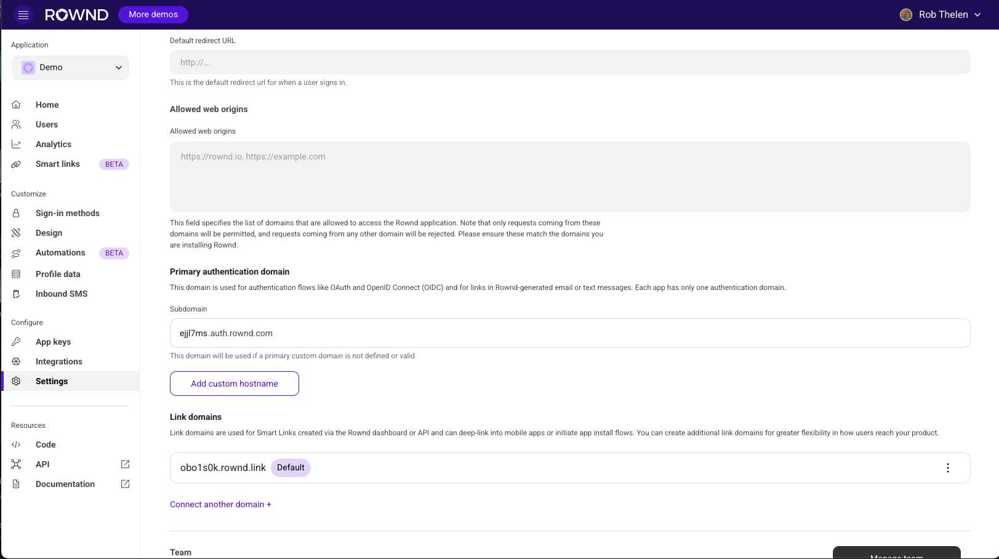
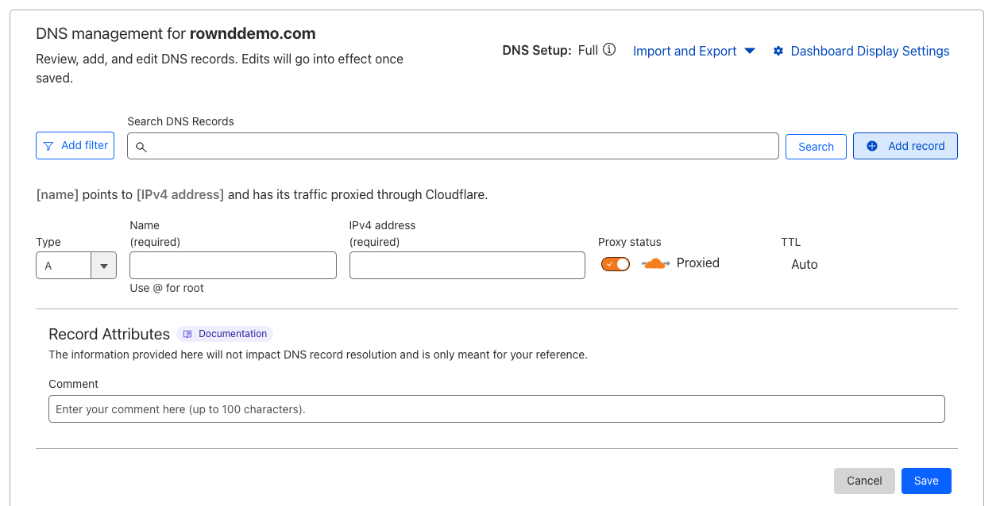
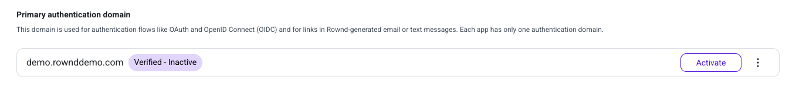
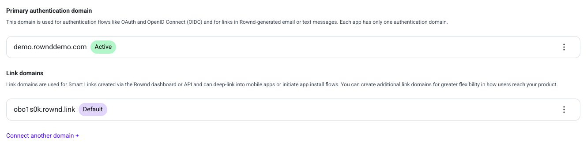

Custom domains allow you to maintain a consistent brand experience throughout your users' authentication journey. By configuring a custom domain, all authentication flows, magic links, and auth-related emails will use your domain instead of Rownd's default domains.

## Benefits of Custom Domains

- **Enhanced Brand Trust**: Users see only your domain throughout the entire authentication process
- **Improved Deliverability**: Email providers often trust established domains more than third-party services
- **Consistent User Experience**: Seamless transitions between your application and authentication flows
- **HIPAA and Compliance**: Help meet regulatory requirements for sensitive industries

## Setting Up Custom Domains

### Step 1: Access Domain Settings

Navigate to the Settings section in the left sidebar of your Rownd dashboard.

### Step 2: Add Your Custom Domain

Under the "Primary authentication domain" section, you'll see your current authentication domain. To add a custom domain:

1. Type your domain (e.g., auth.acme.com)
2. The domain will show as "Pending" until verified

### Step 3: Configure DNS Records

To verify ownership of your domain, you need to add two DNS records:

1. **CNAME Record**: Points your domain to Rownd's authentication servers
   - Name: Your custom domain (e.g., auth.acme.com)
   - Value: The provided Rownd endpoint (e.g., eijl7ms.auth.rownd.com)

2. **TXT Record**: Verifies your ownership of the domain
   - Name: _cf-custom-hostname.your-domain (e.g., _cf-custom-hostname.auth.com)
   - Value: The provided verification string (e.g., 5edk2cd9-030da-453d-8450-8221b2aasdfasf)

Add these records through your DNS provider's management console:

#### DNS Provider Instructions

We provide step-by-step instructions for configuring DNS records with popular providers:

- [Cloudflare](/configuration/custom-domains/dns-records#1-cloudflare)
- [GoDaddy](/configuration/custom-domains/dns-records#2-godaddy)
- [Google Cloud DNS](/configuration/custom-domains/dns-records#3-google-cloud-dns)
- [AWS Route 53](/configuration/custom-domains/dns-records#4-aws-route-53)
- [Azure DNS](/configuration/custom-domains/dns-records#5-azure-dns)
- [Namecheap](/configuration/custom-domains/dns-records#6-namecheap)
- [DigitalOcean DNS](/configuration/custom-domains/dns-records#7-digitalocean-dns)
- [Hover](/configuration/custom-domains/dns-records#8-hover)
- [DNS Made Easy](/configuration/custom-domains/dns-records#9-dns-made-easy)
- [Dyn Managed DNS](/configuration/custom-domains/dns-records#10-dyn-managed-dns)
- [Squarespace](/configuration/custom-domains/dns-records#11-squarespace)

For detailed instructions on setting up DNS records with your specific provider, see our [DNS Provider Steps](/configuration/custom-domains/dns-records).

### Step 4: Wait for Verification

After adding the DNS records, Rownd will automatically verify your domain. This process typically takes 5-10 minutes but can sometimes take up to 24-48 hours, depending on your DNS provider's propagation time.

Once verified, your domain will show as "Verified - Inactive":

### Step 5: Activate Your Custom Domain

Click the "Activate" button to start using your custom domain for authentication. Once activated, all authentication flows, emails, and links will use your custom domain.

## Link Domains

In addition to your primary authentication domain, you can also configure link domains for Smart Links. These domains are used when creating deep links to your application for authentication flows, app installs, and user onboarding.

To add a link domain, navigate to the "Link domains" section below your primary authentication domain settings.

### Smart Links with Custom Domains

[Smart Links](/magic-links/overview) can be used with your custom domains to create a seamless branded experience for your users. These links function similarly to Branch links, providing powerful attribution and deep linking capabilities, but with full customization under your own domain.

Smart Links can be used in various scenarios:

- **[Authenticated Experiences](/magic-links/authenticated)**: Send authenticated deep links that maintain user context and session state
- **[Unauthenticated Experiences](/magic-links/unauthenticated)**: Create public links for app installs, onboarding flows, or marketing campaigns
- **[Cross-Platform Experiences](/magic-links/platform)**: Direct users to the appropriate experience based on their device and context

By using a custom domain for your Smart Links, you enhance brand trust and recognition while maintaining all the functionality of Rownd's link management system.

## Troubleshooting

If your domain verification fails to complete:

1. **Check DNS Configuration**: Ensure both CNAME and TXT records are correctly configured
2. **Wait for Propagation**: DNS changes can take time to propagate globally
3. **Verify Domain Format**: Ensure your domain format matches exactly what's specified in the Rownd dashboard
4. **Contact Support**: If issues persist, contact Rownd support for assistance

## Notes and Limitations

- Each Rownd application can have one active authentication domain at a time
- You can have multiple verified domains but only one can be active
- Custom domains require proper SSL/TLS certificate configuration, which Rownd handles automatically
- Custom domain email deliverability may require additional SPF/DKIM configuration for optimal results
