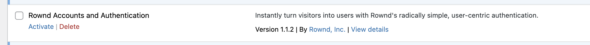

# 🚀 Getting started

Deploying Rownd should be a relatively straightforward process. It typically involves a few steps:

* Select the initial user profile fields in the Rownd dashboard
* Deploy the Rownd snippet to your websites
* (optional) Add the Rownd SDK to front-end and back end servers


By deploying Rownd to your main website, blog, docs, etc, you can begin onboarding users even before having an app. For example, if you're creating a waitlist for your product, Rownd can manage the sign-up process. You can even leverage Rownd to gradually on-ramp users to your app once it's ready for beta testers.


### Select initial user profile fields

1. Open the Rownd dashboard
2. Create your first application if prompted and select or create the desired profile fields:\
   
3. After the app is created, a Javascript code snippet will be generated. Click the copy button to store it in your clipboard.

### Deploy the Rownd snippet to your websites

After copying the code snippet, you'll need to add it to your websites.&#x20;
